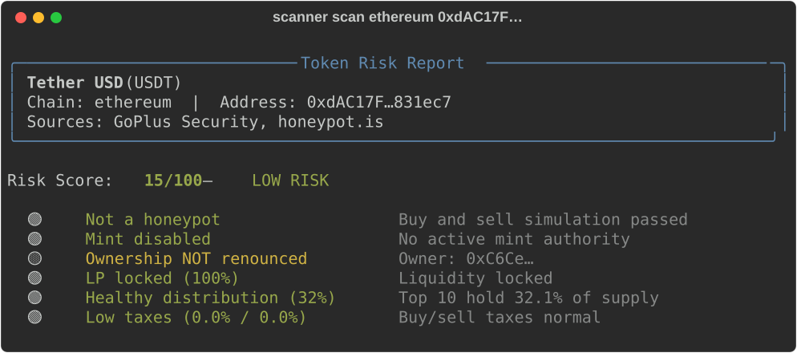

# Token Risk Scanner

CLI tool that scans token contracts for common risks: honeypot detection, mint authority, LP lock status, holder concentration, buy/sell taxes, ownership renouncement.

[](LICENSE)
[](https://www.python.org/downloads/)

Enter a chain and contract address — get a color-coded risk report with a 0-100 score.



## ⚠️ Disclaimer

This tool shows **signals**, not financial advice. It aggregates publicly available data from GoPlus Security and honeypot.is. Always do your own research. A "clean" scan does not guarantee a token is safe. A "risky" scan does not mean a token is necessarily a scam.

## Features

- **Honeypot detection** — buy/sell simulation via honeypot.is
- **Mint authority** — checks if contract owner can mint unlimited tokens
- **LP lock** — whether liquidity pool is locked
- **Holder concentration** — top-10 wallet concentration
- **Buy/sell tax** — detects high or extreme taxes
- **Ownership** — whether contract ownership is renounced
- **Proxy detection** — flags upgradeable contracts
- Supports **EVM chains** (Ethereum, BSC, Polygon, Arbitrum, Base, Avalanche, Optimism) and **Solana**
- Color-coded output with risk flags (🔴 🟡 🟢)

## Install

```bash
pip install -e .
```

## Usage

```bash
# Scan an Ethereum token
scanner scan ethereum 0xdAC17F958D2ee523a2206206994597C13D831ec7

# Scan a BSC token
scanner scan bsc 0xe9e7CEA3DedcA5984780Bafc599bD69ADd087D56

# Scan a Solana token
scanner scan solana EPjFWdd5AufqSSqeM2qN1xzybapC8G4wEGGkZwyTDt1v

# Chain aliases work too
scanner scan eth 0x1234...
scanner scan polygon 0x5678...
```

### Example Output

```
╭──────────────── Token Risk Report ────────────────╮
│ Tether USD (USDT)                                 │
│ Chain: ethereum  |  Address: 0xdAC17F...          │
│ Sources: GoPlus Security, honeypot.is             │
╰───────────────────────────────────────────────────╯

  Risk Score: 15/100  —  LOW RISK — Some concerns

  🟢  Not a honeypot              Buy and sell simulation passed
  🟢  Mint disabled               No active mint authority
  🟡  Ownership NOT renounced     Owner: 0xC6Ce...
  🟢  LP locked (100%)            Liquidity locked
  🟢  Healthy distribution (32%)  Top 10 wallets hold 32.1% of supply
  🟢  Low taxes (0.0% / 0.0%)     Buy and sell taxes are within normal range
```

## How Scoring Works

| Signal | Severity | Points |
|--------|----------|--------|
| Honeypot detected | 🔴 RED | +40 |
| Mint authority active | 🔴 RED | +25 |
| Extreme holder concentration (>80%) | 🔴 RED | +20 |
| Extreme sell tax (>25%) | 🔴 RED | +20 |
| Extreme buy tax (>25%) | 🔴 RED | +15 |
| LP not locked | 🟡 YELLOW | +15 |
| Ownership not renounced | 🟡 YELLOW | +10 |
| High holder concentration (>50%) | 🟡 YELLOW | +10 |
| High sell tax (>10%) | 🟡 YELLOW | +10 |
| High buy tax (>5%) | 🟡 YELLOW | +5 |
| Proxy contract | 🟡 YELLOW | +5 |
| Unverified source | 🟡 YELLOW | +5 |

Score capped at 100. Verdict: 0-9 MINIMAL, 10-29 LOW, 30-59 MEDIUM, 60+ HIGH.
Confirmed honeypot detection always gives a red `HIGH RISK` verdict, including when its +40 points are the only detected risk. The numeric score and signal weights remain unchanged.
Missing signals remain unknown. A scan without core risk data reports `UNKNOWN`; partial coverage is labeled incomplete, and provider failures are shown. Conflicting provider signals are merged conservatively. LP lock verification is not implemented by the bundled providers, so a live report normally has incomplete coverage.

## Architecture

```
src/scanner/
├── cli.py              # Typer CLI
├── models.py           # TokenInfo, RiskReport, Flag
├── score.py            # Pure scoring functions (deterministic, testable)
├── analyze.py          # Merge data from providers, invoke scoring
└── providers/
    ├── __init__.py      # Abstract TokenProvider interface
    ├── goplus.py        # GoPlus Security API
    └── honeypot.py      # honeypot.is API
```

Providers implement a common interface — easy to add new data sources.

## Roadmap

- [ ] On-chain LP lock verification via RPC
- [ ] MCP server wrapper (`scan_token` tool)
- [ ] Batch scanning from address list
- [ ] Historical risk tracking

## License

MIT
